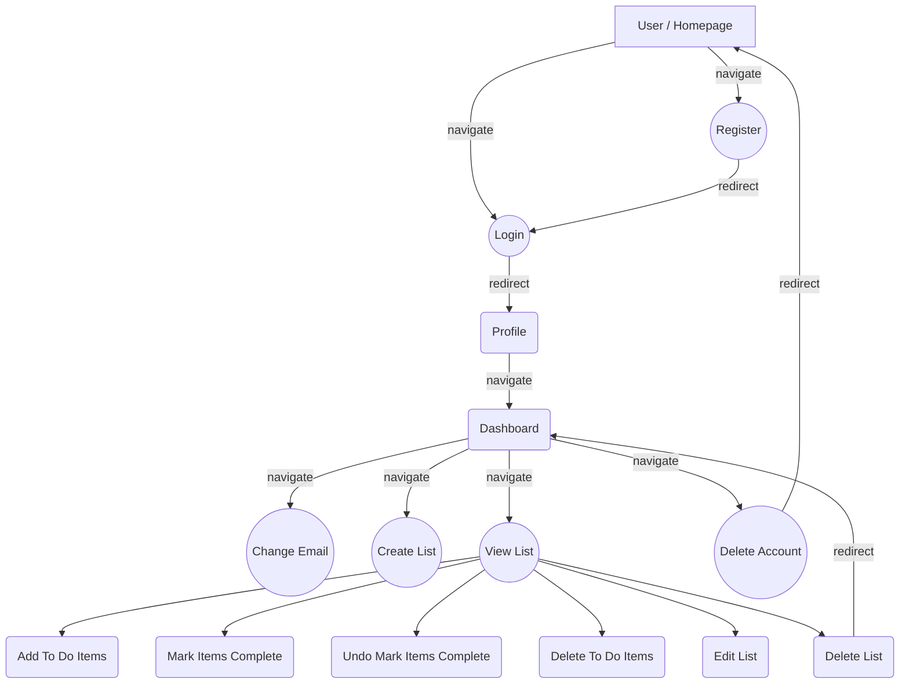

# Project-02
The second project built for my web development portfolio in the stack MENN (MongoDB, Express, Node and Nuxt). This is a multi user to-do list system that allows the user to create to-do lists and share them publicly or keep them private.

I filled all roles for this sample project. Design/Concept, Frontend, and Backend.

# Build Setup
```bash
# install dependencies
$ npm install

# serve with hot reload at localhost:3000
$ npm run dev

# build for production and launch server
$ npm run build
$ npm run start

# generate static project
$ npm run generate
```

For detailed explanation on how things work, check out the [documentation](https://nuxtjs.org).

## User flow


## Contact Me
If you would like to contact me, you can do so via the following: 
***[Email](mailto:webmaster@winterreign.dev) -- [Website](https://winterreign.dev) -- [Twitter](https://camo.githubusercontent.com/2cbca4be42d81c6833fd417d74f5322e80861326d03d52289924138947be7b4e/68747470733a2f2f696d672e736869656c64732e696f2f62616467652f547769747465722d2532333144413146322e7376673f6c6f676f3d54776974746572266c6f676f436f6c6f723d7768697465) -- [Showwcase](https://www.showwcase.com/winterreigndev)***
